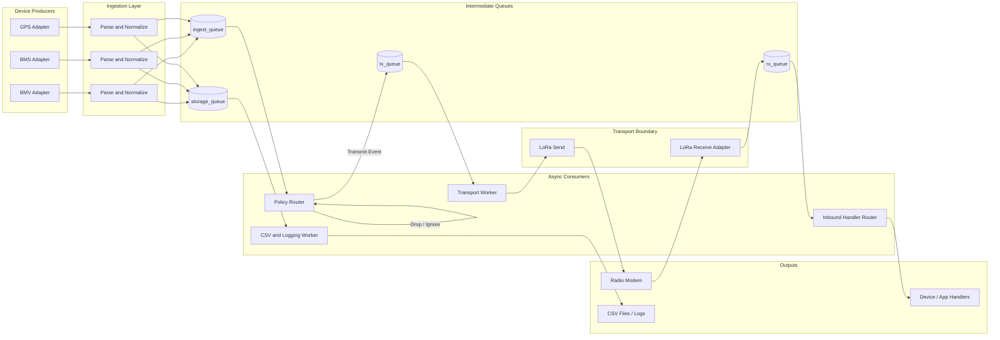

# Event-Driven Strategy for Telemetry

## Goal

Convert the telemetry system from blocking per-device loops into a shared event-driven architecture that can handle multiple concurrent sources such as:

- BMV
- BMS
- GPS
- future sensors or subsystems

The desired outcome is:

- readers react to incoming data instead of polling in tight loops
- device readings are emitted as events into a shared pipeline
- policy, logging, encoding, and transport are decoupled from device I/O
- multiple device types can coexist without each one owning its own blocking send loop

## Current State

The repo is currently mixed:

- `BMV/bmv_v2.py` already uses `asyncio` with `loop.add_reader(...)` and is event-driven for serial input
- `BMV/bmv_reader.py` is still blocking and uses `while True` with `serial.readline()`
- `telemetry_sender.py` pulls readings synchronously from `reader.read_frame()`
- `telemetry_receiver.py` polls the LoRa modem with `AT+RECV`
- `LORA/lora_transport.py` is request/response oriented and still contains polling-style waits and sleeps

This means the system is not yet fully event-driven end to end.

## Design Principles

1. Device I/O should be non-blocking whenever the hardware interface allows it.
2. Every device should publish normalized events into a shared event bus.
3. Transmission should be handled by dedicated async consumers, not inline inside device readers.
4. Slow work such as CSV writes, compression, or retries should not block data ingestion.
5. The architecture must support multiple simultaneous event sources.
6. If a hardware interface cannot be truly event-driven, isolate polling inside a small adapter so the rest of the system remains event-driven.

## Target Architecture

The system should be organized as a pipeline:

`device reader -> parser -> normalized event -> event bus -> policy/router -> outbound queue -> transport`

And in parallel:

`normalized event -> storage/logging/metrics`

On the receive side:

`transport input -> parser -> decoded packet event -> inbound bus -> handler/router`

## Visual Flow Diagram

### Diagram Notes

- each device adapter is a producer that emits normalized events
- `ingest_queue` carries live events into the policy layer
- `storage_queue` lets logging run without blocking device input
- `tx_queue` isolates transmission from policy decisions
- `rx_queue` separates raw transport reception from decoded packet handling
- the LoRa modem is the shared transport boundary for both outbound and inbound flow

## Core Building Blocks

### 1. Shared Event Model

Create one common envelope that every source can emit.

Suggested fields:

- `source`: `bmv`, `bms`, `gps`
- `event_type`: `sample`, `alarm`, `threshold_crossing`, `delta_update`, `heartbeat`, `fix`, `fault`
- `timestamp`
- `device_id`
- `fields`: normalized payload data
- `raw`: optional raw frame or line
- `priority`: optional field for scheduling and drop rules
- `seq`: assigned only when preparing outbound transmission

This keeps downstream code source-agnostic.

### 2. Event Bus

Use `asyncio.Queue` as the internal event bus.

Recommended queues:

- `ingest_queue`: normalized device events
- `tx_queue`: outbound events selected for transmission
- `storage_queue`: events destined for CSV or persistent logging
- `rx_queue`: decoded inbound telemetry packets

This decouples acquisition from policy and transport.

### 3. Device Reader Adapters

Each source should have a dedicated adapter responsible only for:

- opening the device interface
- buffering bytes or lines
- detecting message boundaries
- parsing complete frames
- emitting normalized events

Examples:

- `BMVReaderAdapter`
- `BMSReaderAdapter`
- `GPSReaderAdapter`

These adapters should not directly:

- send packets
- write CSV
- perform business policy
- own retry logic unrelated to input parsing

### 4. Policy Layer

Each source can keep device-specific policy, but expose a common interface.

Suggested pattern:

- input: normalized event
- output: transmit decision or `None`

Examples:

- BMV policy: alarm, threshold crossing, delta update, heartbeat
- BMS policy: overvoltage alarm, undervoltage alarm, balance-state change, heartbeat
- GPS policy: first fix, geofence crossing, speed threshold crossing, heartbeat

### 5. Async Transport Worker

The transport should be the only component that writes to the modem.

Responsibilities:

- consume outbound events from `tx_queue`
- build packet bytes
- serialize writes to the modem
- track acknowledgements or failures
- publish transport status events if needed

This avoids contention when multiple device types want to transmit over the same radio.

### 6. Async Storage Worker

CSV and persistent logging should be handled out of band.

Responsibilities:

- consume events from `storage_queue`
- write CSV or database records
- batch if useful
- avoid blocking serial input callbacks

## Event Types

The system should distinguish between logical event classes and transport message types.

Logical event classes:

- `sample`
- `delta_update`
- `threshold_crossing`
- `alarm`
- `heartbeat`
- `fix`
- `fault`
- `status`

Transport message types:

- `BMV`
- `BMS`
- `GPS`
- transport control or diagnostics packets if needed later

This separation allows policy to evolve without tightly coupling it to packet encoding.

## Flow by Component

### Device Ingestion Flow

1. Device bytes or lines arrive on a serial port or socket.
2. Reader callback is triggered by the event loop.
3. The adapter appends to its buffer.
4. When a complete frame is available, it is parsed.
5. The parsed frame is normalized into a common event.
6. The event is pushed to `ingest_queue`.
7. The same normalized event can also be copied to `storage_queue`.

### Transmission Flow

1. A policy task consumes events from `ingest_queue`.
2. It routes each event to the correct source-specific policy.
3. If the policy decides to transmit, it assigns sequence metadata and produces an outbound event.
4. The outbound event is pushed to `tx_queue`.
5. The transport worker encodes and sends the packet asynchronously.

### Reception Flow

1. Incoming modem data is read by an async adapter.
2. A receive parser extracts hex payloads or modem frames.
3. The payload is decoded into a packet structure.
4. A normalized inbound event is pushed to `rx_queue`.
5. A handler task routes by message type and source.

## Migration Plan

### Phase 1: Introduce Shared Event Types

Add:

- an event schema module
- queue definitions
- a small dispatcher/router interface

Do this before changing device behavior so the transition path is clear.

### Phase 2: Convert BMV to an Event Producer

Use `BMV/bmv_v2.py` as the starting point.

Refactor it so that:

- `on_serial_ready()` only parses input and emits events
- CSV writing moves out into a storage consumer
- compression and packet generation move into downstream consumers

At this point BMV becomes the first true producer in the shared architecture.

### Phase 3: Refactor `telemetry_sender.py`

Replace the synchronous pull loop with async tasks:

- ingestion consumer task
- policy task
- transmit task
- storage task

The sender should no longer call `reader.read_frame()` directly.

### Phase 4: Generalize for BMS and GPS

Add adapters with the same contract:

- parse raw input
- normalize data
- emit events

The rest of the pipeline should not need to know whether an event came from BMV, BMS, or GPS.

### Phase 5: Refactor LoRa Send Path

Move LoRa transmission behind a dedicated async worker.

Important rules:

- only one writer should own the modem at a time
- send operations should be serialized
- retry and ACK handling should happen inside the transport worker

### Phase 6: Refactor Receive Path

Replace the current polling loop in `telemetry_receiver.py` with one of these approaches:

- preferred: event-driven modem read if the modem emits unsolicited receive lines
- fallback: isolated polling adapter that emits events into the async pipeline

If the modem requires `AT+RECV` polling, accept that the hardware boundary is polling-based and keep that logic isolated in one adapter rather than throughout the codebase.

### Phase 7: Add Prioritization and Backpressure

Once multiple producers are live, protect the system from overload.

Recommended behavior:

- alarms are highest priority and must not be dropped
- repeated low-value samples may be coalesced
- GPS updates can be reduced to latest-only during bursts
- queue sizes should be bounded
- overflow should emit diagnostics

## Recommended Module Layout

Suggested structure:

- `events/`
- `events/models.py`
- `events/bus.py`
- `events/router.py`
- `devices/`
- `devices/bmv_adapter.py`
- `devices/bms_adapter.py`
- `devices/gps_adapter.py`
- `policy/`
- `policy/bmv_policy.py`
- `policy/bms_policy.py`
- `policy/gps_policy.py`
- `transport/`
- `transport/lora_async.py`
- `storage/`
- `storage/csv_worker.py`
- `app/`
- `app/sender_runtime.py`
- `app/receiver_runtime.py`

This can be introduced gradually without deleting the current modules immediately.

## Runtime Model

At startup, the application should create tasks such as:

- one task per device adapter
- one ingest-policy task
- one transport task
- one storage task
- one receiver task
- one health or watchdog task if needed

This gives a model closer to:

- many producers
- shared queues
- a few specialized consumers

instead of:

- one script tightly coupling reading, policy, storage, and transmission

## Error Handling and Recovery

The event-driven design should also define what happens when devices fail.

Required behavior:

- serial disconnects should emit status events
- adapters should attempt reconnect with backoff
- malformed frames should be logged without killing the process
- transport failures should emit diagnostics and retry according to policy
- cancellation should close serial ports cleanly

## Practical Notes for This Repo

### BMV

Current best migration base:

- `BMV/bmv_v2.py`

Current blocker:

- it still mixes parsing with CSV writing and compression side effects

### Sender

Current blocker:

- `telemetry_sender.py` still depends on blocking `reader.read_frame()`

### Receiver

Current blocker:

- `telemetry_receiver.py` uses `while True` plus `time.sleep(...)`

### LoRa Transport

Current blocker:

- `LORA/lora_transport.py` is command-poll oriented and includes fixed waits

This means the immediate next step is not to rewrite everything at once, but to first define the async contracts and move one device at a time onto them.

## Recommended First Implementation Steps

1. Add a shared event model and event bus.
2. Refactor BMV into a pure event producer.
3. Move CSV writing into an async storage worker.
4. Rewrite `telemetry_sender.py` as an async runtime using queues.
5. Add a dedicated async LoRa transmit worker.
6. Refactor the receiver path into an adapter plus event dispatcher.
7. Add BMS and GPS adapters using the same interface.

## Summary

The system should move from:

- read a frame
- decide immediately
- send immediately

to:

- emit an event when data arrives
- route that event through shared queues
- let policy, storage, and transport react independently

That architecture is the right fit for a telemetry system that will receive concurrent events from BMV, BMS, GPS, and future devices.
